# 🇨🇦 Edmonton Urban Efficiency: Algorithmic Infrastructure Optimization


> **"Where should we build the next Fire or Police Station to save the most lives and maximize budget efficiency?"**

**Live App:** [ urban-efficiency.vercel.app](https://urban-efficiency.vercel.app/)

##  Project Mission
**Edmonton Urban Efficiency** is a data-driven decision-support tool designed for municipal authorities. Developed as the **Capstone Project** for the **MIT Emerging Talent** program, this application enables smarter urban planning.

Unlike black-box predictions, it utilizes a transparent, custom-built **Grid-Based Spatial Analysis Algorithm** to process historical data and mathematically identify "high-risk, low-coverage" zones.

## 📄 Documentation & Deliverables

Here are the detailed reports and presentation decks regarding the project architecture and development process:

**[Download Project Presentation (Google Drive)](https://drive.google.com/drive/folders/1DtAmPwiBxBOfxwWOUMg_PT0dU33eQn8I?usp=sharing)**
*  **[Read the Full Technical Report (PDF)](./docs/Edmonton_Urban_Efficiency_Technical_Report.pdf)**
*  **[View Capstone Presentation (PPTX)](./docs/Fevzi_Ismail_Sahin_Capstone_Presentation.pptx)**
*  **[Read Final Retrospective (PDF)](./docs/Fevzi_Ismail_Sahin_Capstone_Retrospective.pdf)**
 

---
##  The Algorithm: How It "Thinks"

The core value of this project is not just displaying data, but **interpreting it**. The algorithm calculates a "Priority Score" for every square kilometer using a **Minimization & Weighted Scoring Logic**.

Here is the step-by-step visual breakdown:

### Phase 1: Grid Mapping
First, the system divides the city into intelligent grid cells and identifies existing infrastructure.

| 1. Raw Satellite View | 2. Vector Grid Overlay | 3. Station Identification |
| :---: | :---: | :---: |
| 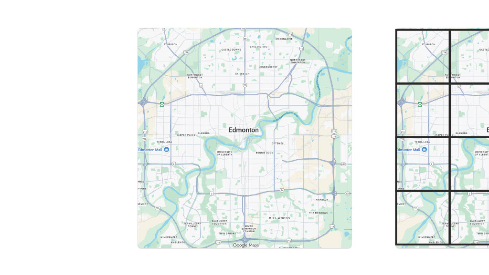 | 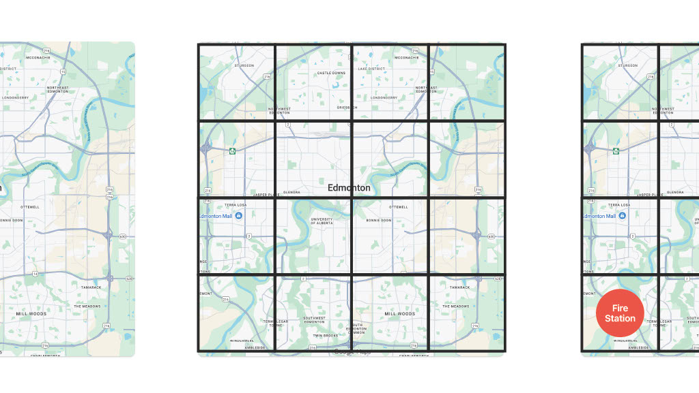 | 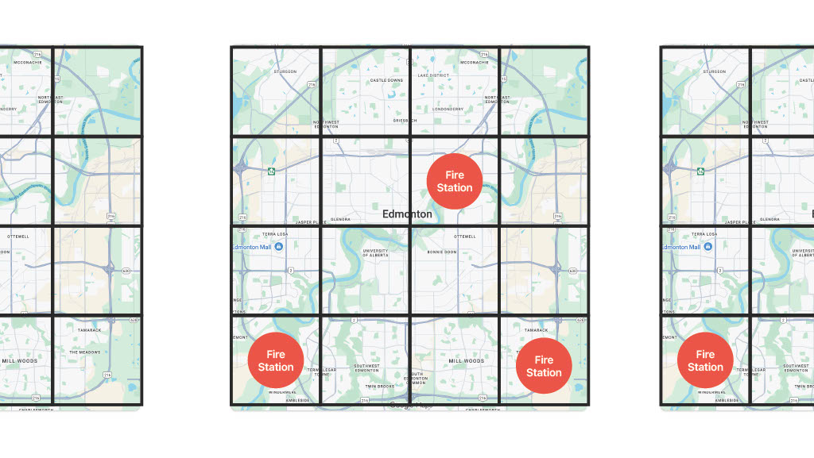 |
| *The base map of Edmonton.* | *Dividing the map into calculating units.* | *Marking existing Fire Stations (Red Nodes).* |

### Phase 2: Propagation & Optimization
The algorithm calculates the distance from stations. Crucially, it uses a **Minimization Logic**: if a grid cell receives a value from a closer station (a smaller number), it updates itself to that smaller value.

| 4. Focus on Source | 5. Neighbor Logic | 6. **Value Optimization** |
| :---: | :---: | :---: |
| 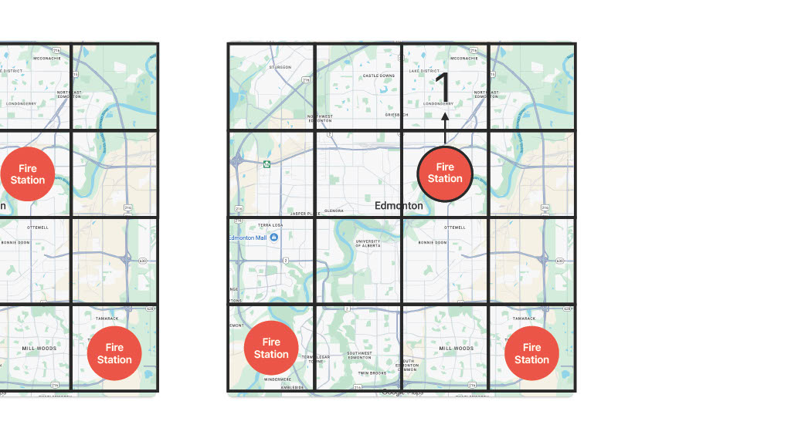 | 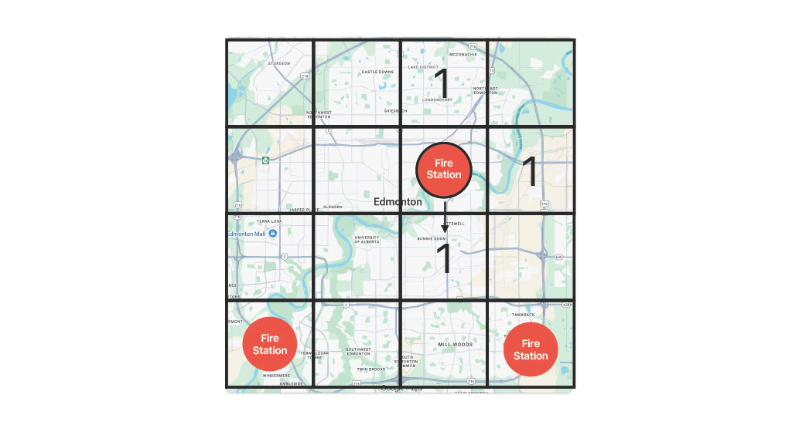 | 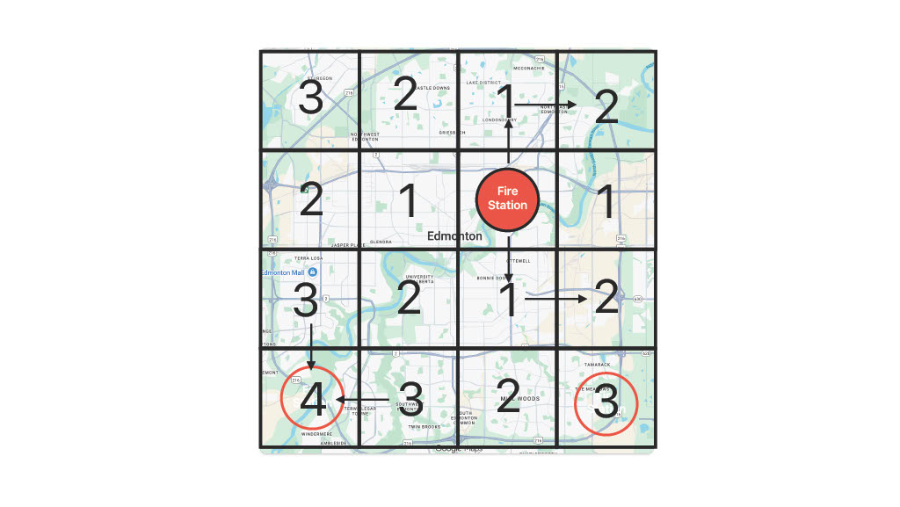 |
| *Starting from a Fire Station (Value: 0).* | *Spreading to neighbors.* | *Grids always update to the **lowest** possible distance value (Nearest Station Logic).* |

### Phase 3: Weighted Risk Calculation
Finally, the system combines two datasets. It doesn't just look at distance; it looks at **demand**.
$$Risk Score = (Distance Value) \times (Incident Count)$$

| 7. Distance Grid | 8. **Final Weighted Score** |
| :---: | :---: |
| 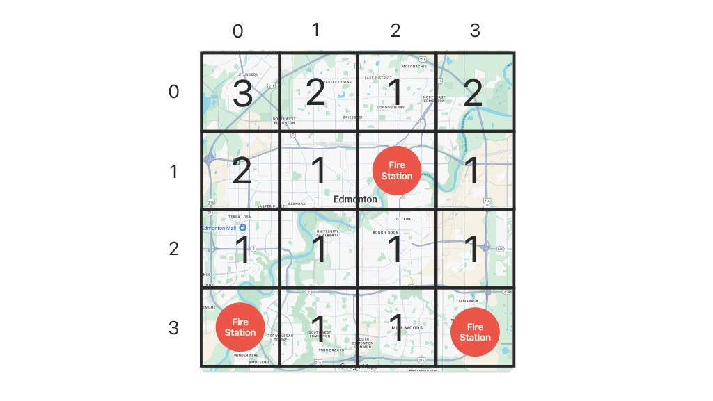 | 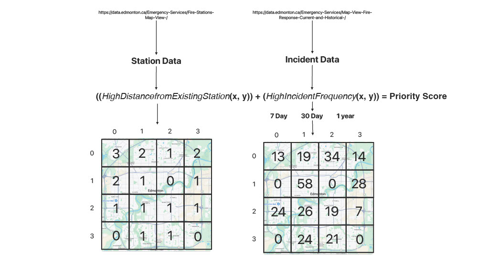 |
| *Final distance values assigned to grids.* | *Distance is **multiplied** by Incident Density. High Distance x High Incidents = **MAX PRIORITY**.* |

> **Logic Summary:** The algorithm highlights areas that are **far from help** (High Distance) AND **statistically dangerous** (High Incidents).

---

---

## How to Use the Application (User Guide)

The web application is designed to be intuitive for city planners and the public. Here is a walkthrough of the interface using the live system.

### Step 1: The Main Dashboard
When the application loads, you are presented with a clean map of Edmonton and a sidebar for controls.

| Initial Load & Controls |
| :---: |
| 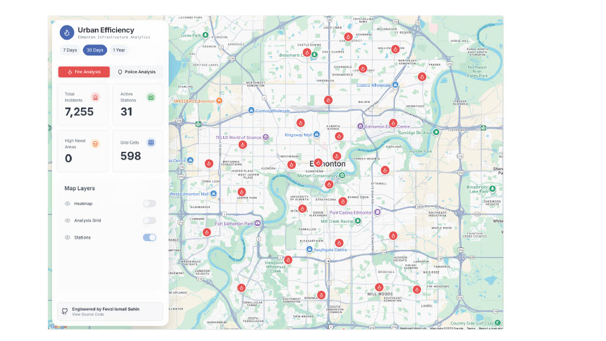 |
| *The main view showing the city map and the control panel on the left.* |

### Step 2: Analyzing a Location
To understand the risk profile of a specific area, simply **click on any grid square** on the map. The system will instantly calculate and display data for that location.

| Interactive Click Analysis |
| :---: |
| 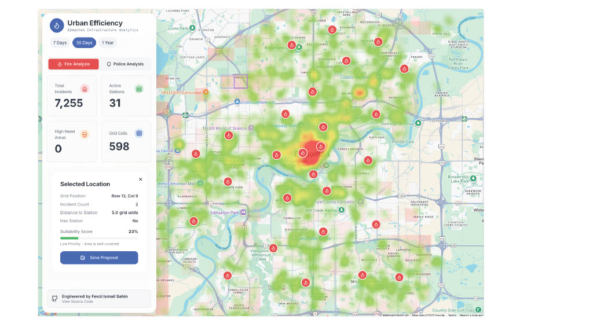 |
| *Clicking a grid highlights it and opens the detailed analysis panel.* |

### Step 3: Detailed Risk Reporting
Once a grid is selected, the sidebar updates with a comprehensive report. This is where the algorithmic scoring is visualized for the user.

| Data Visualization | Score Breakdown |
| :---: | :---: |
| 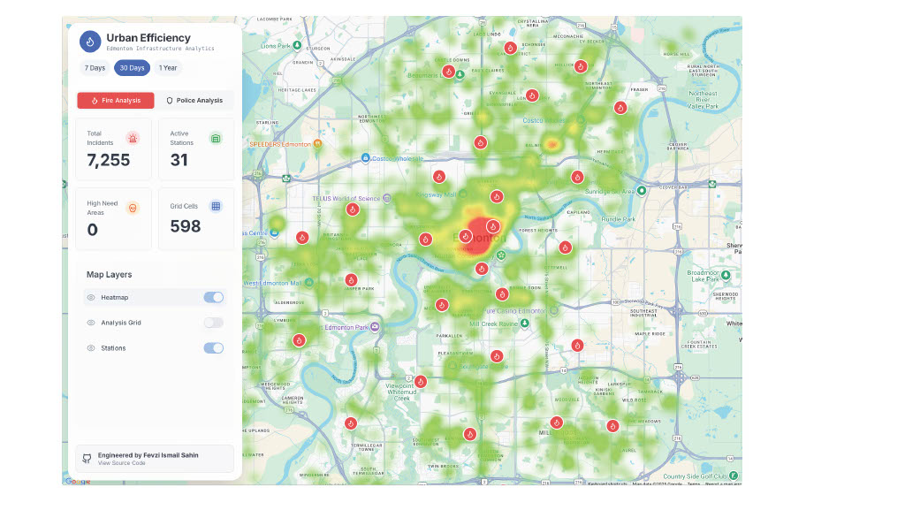 |  |
| *Charts comparing local incident data against the city average.* | *The final "Priority Score" and factors like "Distance to Station."* |

### Step 4: The Result (High-Risk Identification)
By clicking around, users can identify "red zones." The example below shows a high-priority area that has both a high incident rate and is far from existing help.

| Identifying a "Red Zone" |
| :---: |
| 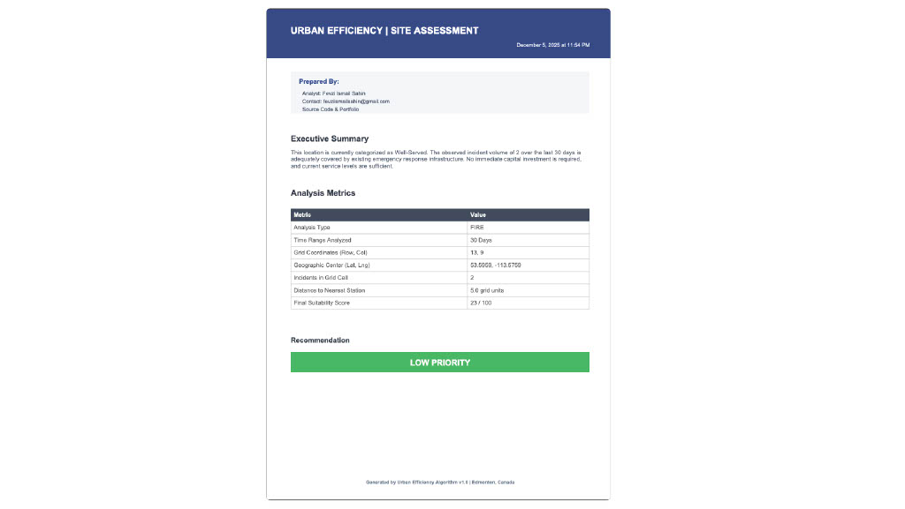 |
| *An example of a high-priority grid identified by the system.* |

---
## Data Architecture & Sources
This project uses a **hybrid data strategy** to balance performance and real-time accuracy.

### 1. Fire & Rescue (Socrata API)
* **Infrastructure (Static):** Fire Station locations stored locally for speed (`/data/static`).
* **Incidents (Dynamic):** Historical response data fetched via **Socrata SODA API** to generate density maps.

### 2. Police & Crime (ArcGIS REST API)
* **Infrastructure (Static):** Police Station nodes (`/data/static`).
* **Incidents (Dynamic):** Real-time crime reporting (EPS Occurrences) fetched from **ArcGIS FeatureServer**.
    * *Query:* Filters for current year (`Reported_Year='2025'`).

### 3.  Folder Structure
```text
.
├── assets/                   # Algorithm visualization images
├── data/
│   ├── static/               # Fixed nodes (Stations)
│   └── raw_sample/           # Offline GeoJSON snapshots (Backup)
├── docs/                     # Technical Report & Research
├── src/                      # Source code (Next.js/React)
└── README.md
```
---

## Tech Stack

* **Frontend:** React.js / Next.js (Interactive Grid UI)
* **Mapping:** Google Maps API
* **Logic:** Custom JavaScript Algorithms & Python (Preprocessing)
* **APIs:** Edmonton Open Data (SODA3), ArcGIS REST API
* **Deployment:** Vercel

---

## Development Journey (MIT Milestones)

This project was executed following the strict **Data Science Lifecycle** milestones required by the MIT Emerging Talent curriculum:

1.  **Problem Identification:** Addressing inefficiency in static infrastructure planning.
2.  **Data Collection:** Integrating diverse streams (GeoJSON, SODA2/SODA3 API, ArcGIS(EPS)).
3.  **Analysis:** Engineering the Grid-Based Priority Algorithm.
4.  **Final Deliverable:** A public-facing, interactive decision support tool.

---

## 👨‍💻 The Developer

**Fevzi Ismail Sahin**
*Computer Engineering Student & MIT ET Scholar*

Specializing in Spatial Analysis, and Full-Stack Development.

*  **Email:** [fevziismailsahin@gmail.com](mailto:fevziismailsahin@gmail.com)
*  **GitHub:** [@fevziismailsahin](https://github.com/fevziismailsahin)
*  **LinkedIn:** [Fevzi  Sahin](https://www.linkedin.com/in/fevzi-ismail-şahin-a5b37820b) 